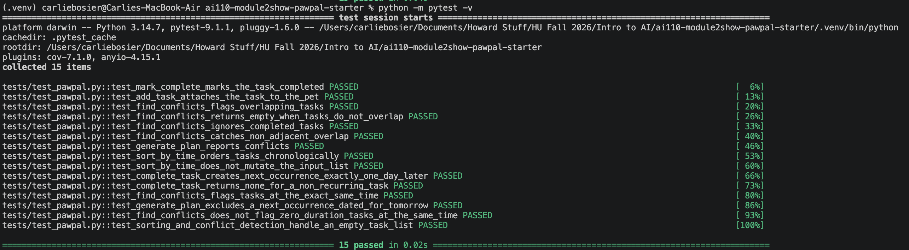
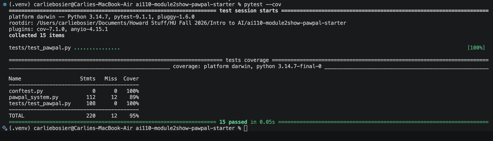

# PawPal+ (Module 2 Project)

You are building **PawPal+**, a Streamlit app that helps a pet owner plan care tasks for their pet.

## Scenario

A busy pet owner needs help staying consistent with pet care. They want an assistant that can:

- Track pet care tasks (walks, feeding, meds, enrichment, grooming, etc.)
- Consider constraints (time available, priority, owner preferences)
- Produce a daily plan and explain why it chose that plan

Your job is to design the system first (UML), then implement the logic in Python, then connect it to the Streamlit UI.

## What you will build

Your final app should:

- Let a user enter basic owner + pet info
- Let a user add/edit tasks (duration + priority at minimum)
- Generate a daily schedule/plan based on constraints and priorities
- Display the plan clearly (and ideally explain the reasoning)
- Include tests for the most important scheduling behaviors

## Getting started

### Setup

```bash
python -m venv .venv
source .venv/bin/activate  # Windows: .venv\Scripts\activate
pip install -r requirements.txt
```

### Suggested workflow

1. Read the scenario carefully and identify requirements and edge cases.
2. Draft a UML diagram (classes, attributes, methods, relationships).
3. Convert UML into Python class stubs (no logic yet).
4. Implement scheduling logic in small increments.
5. Add tests to verify key behaviors.
6. Connect your logic to the Streamlit UI in `app.py`.
7. Refine UML so it matches what you actually built.

## 🖥️ Sample Output

Paste a sample of your app's CLI or Streamlit output here so a reader can see what a generated plan looks like:
========================================
        ALL TASKS, SORTED BY TIME
========================================
  - [Sep 18, 11:20 AM] Weekly nail trim
  - [Sep 25, 11:20 AM] Morning walk
  - [Sep 26, 08:20 AM] Litter box scoop
  - [Sep 26, 10:20 AM] Evening medication
  - [Sep 26, 10:20 AM] Evening playtime

========================================
        FILTER: BISCUIT'S TASKS ONLY
========================================
  - Evening medication
  - Morning walk
  - Evening playtime

========================================
        FILTER: COMPLETED TASKS ONLY
========================================
  - Litter box scoop

========================================
        TODAY'S SCHEDULE
========================================

Scheduled:
  - Weekly nail trim (20 min)
  - Evening medication (5 min)
  - Evening playtime (15 min)

Deferred:
  - Morning walk (30 min)

Why these choices:
  - Scheduled 'Weekly nail trim' (20 min): it fit the time left, leaving 25 min.
  - Deferred 'Morning walk' (30 min): only 25 min left in the budget.
  - Scheduled 'Evening medication' (5 min): it fit the time left, leaving 20 min.
  - Scheduled 'Evening playtime' (15 min): it fit the time left, leaving 5 min.
  - Warning: 'Evening medication' and 'Evening playtime' overlap — both run at the same time.

 Conflicts detected:
  - 'Evening medication' overlaps 'Evening playtime'

========================================


## 🧪 Testing PawPal+

```bash
# Run the full test suite:
python -m pytest 

# Run with coverage:
pytest --cov
```

Sample test output:

```
# =================================================================== test session starts ===================================================================
platform darwin -- Python 3.14.7, pytest-9.1.1, pluggy-1.6.0
rootdir: /Users/carliebosier/Documents/Howard Stuff/HU Fall 2026/Intro to AI/ai110-module2show-pawpal-starter
plugins: cov-7.1.0, anyio-4.15.1
collected 15 items                                                                                                                                        

tests/test_pawpal.py ...............                                                                                                                [100%]

===================================================================== tests coverage ======================================================================
____________________________________________________ coverage: platform darwin, python 3.14.7-final-0 _____________________________________________________

Name                   Stmts   Miss  Cover
------------------------------------------
conftest.py                0      0   100%
pawpal_system.py         112     12    89%
tests/test_pawpal.py     108      0   100%
------------------------------------------
TOTAL                    220     12    95%
=================================================================== 15 passed in 0.05s ====================================================================
```



**Confidence Level: (4/5)**
  I feel pretty good about the core scheduling logic at this point. All 15 tests pass with 95% coverage, and the tests actually cover the behaviors that matter, sorting, filtering, recurrence, and conflict detection, not just the easy happy paths. I'm not giving it a full 5 stars though. While testing I found a real bug where completing a task would sometimes let its next occurrence show up as due immediately instead of the following day, and I even had a bug in one of my own tests where I mixed up two task IDs. Both got fixed, but it was a good reminder that passing tests don't automatically mean the logic is airtight. There's also still about 11% of pawpal_system.py that isn't covered by tests yet.
## 📐 Smarter Scheduling

> Fill in once you've implemented scheduling logic.

| Feature | Method(s) | Notes |
|---------|-----------|-------|
| Task sorting | `Scheduler.sort_by_time(tasks)` | Sorts by scheduled `time`, with `task_id` breaking ties. Separate from `_sort_by_priority()`, which orders by how overdue a task is for actual scheduling decisions. |
| Filtering | `Owner.get_tasks_for_pet(pet_id)`, `Owner.get_tasks_by_status(is_completed)` | Return a filtered pet's tasks or tasks by completion status. Both return a new list so filtering never mutates the real task data. |
| Conflict handling | `Scheduler.find_conflicts(tasks)` | Flags any two pending tasks whose durations overlap, including non-adjacent overlaps (a long task colliding with a task two slots later, not just the next one). Completed tasks are excluded. Report-only, doesn't change what gets scheduled. Surfaced through `generate_plan()`'s `"conflicts"` key and warning messages. |
| Recurring tasks | `Task.next_occurrence()`, `Pet.complete_task(task_id)` | Completing a "daily" or "weekly" task through `complete_task()` automatically generates its next occurrence, based on the original scheduled time plus the interval (not the completion time), so a late completion doesn't drift the schedule. |

## 📸 Demo Walkthrough

Describe your app in numbered steps so a reader can follow along without watching a video:

1. <!-- Describe this step -->
2. <!-- Describe this step -->
3. <!-- Describe this step -->
4. <!-- Describe this step -->
5. <!-- Add more steps as needed -->

**Screenshot or video** *(optional)*: <!-- Insert a screenshot or link to a demo video here -->
